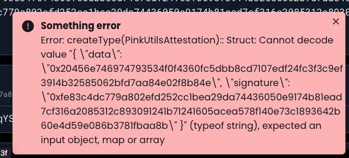

Deploy phala_http_attestation_gist.contract at phat.phala.network UI

Try calling

attest query

passing

https://gist.githubusercontent.com/Entity54/5476bcec0e9263266ad15ec3f9561411/raw/c51066450c5223878b6edfc2d4a3e15d835cd5e9/BE_003.txt

See output in Result at phat.phala.network

Something like

{

"Ok": {

    "data": "0x20456e746974793534f0f4360fc5dbb8cd7107edf24fc3f3c9ef3914b32585062bfd7aa84e02f8b84e",
    "signature": "0xec236ec178068f921d934150d5e279bfbeeb237a3b3c705d5f93486f709ffd694c5760df06e9ba30c7c3ba7f6ff7bfaccaa16e47b70533d1e051f21586841688"

}

}

Call query redeem passing as argument

{
"data": "0x20456e746974793534f0f4360fc5dbb8cd7107edf24fc3f3c9ef3914b32585062bfd7aa84e02f8b84e",
"signature": "0xec236ec178068f921d934150d5e279bfbeeb237a3b3c705d5f93486f709ffd694c5760df06e9ba30c7c3ba7f6ff7bfaccaa16e47b70533d1e051f21586841688"
}

 

> ERROR shows up

 

